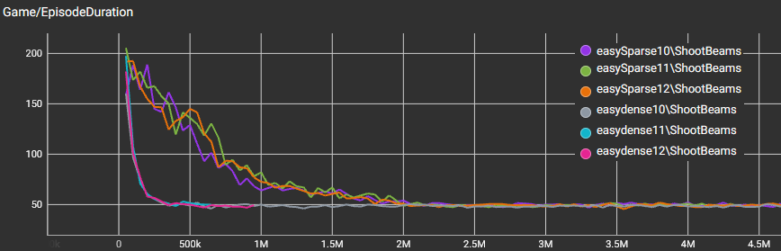
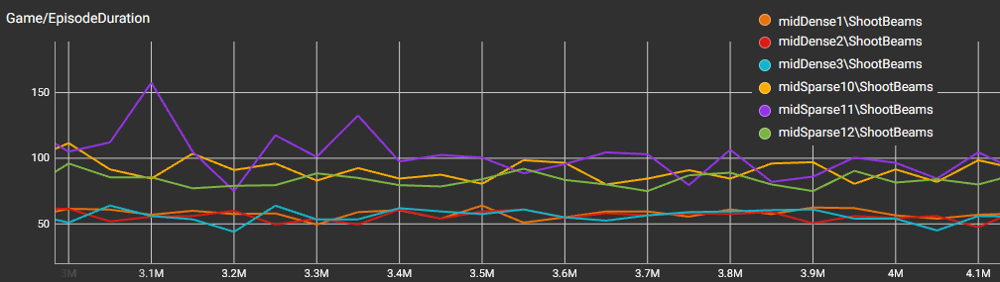
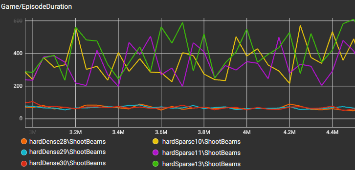

# Bachelorarbeit - Belohnungsstrukturen im Reinforcement Learning

## Überblick

Die Belohnungsstruktur ist einer der wichtigsten Bausteine für effizientes Lernen von RL-Agenten, denn nur mit gutem Feedback weiß ein Agent, wann eine Aktion gut oder schlecht war.

Schon seit 30 Jahren wird an verschiedensten Belohnungsfunktionen geforscht. Manche Forscher geben den RL-Agenten nur dann eine Belohnung, wenn das Endziel erreicht wurde. Andere belohnen auch kleine Zwischenschritte, damit der Agent schneller versteht, in welche Richtung er sich bewegen soll. Wieder andere orientieren sich daran, wie ein Mensch die Aufgabe bewerten würde, und versuchen dieses Verhalten nachzubilden.
Dabei variiert die Performance der Agenten in den Experimenten je nach Aufgabe und Belohnungsfunktion.

Welche dieser Strategien funktioniert aber besser?

Genau das ist der Ausgangspunkt dieser Arbeit. Hier werden zwei unterschiedliche Belohnungsarten direkt miteinander verglichen, indem die Leistung von Agenten mit häufigem Feedback während des Lernens (dense rewards) der Leistung von Agenten mit sparsamen Feedback (sparse rewards) gegenübergestellt wird. Zusätzlich hierzu gibt es 3 verschiedene Schwierigkeitsgrade, um erforschen zu können, welche Art von Belohnungsfunktion bei welcher Schwierigkeitsstufe bessere Ergebnisse erzielt.

---

## Methodik

Um die zwei verschiedenen Belohnungsfunktionen zu vergleichen, wird natürlich auch eine Aufgabe benötigt, die von den Agenten erledigt werden soll.

Wie erwähnt gibt es 3 verschiedene Schwierigkeitsstufen, mit jeder Stufe erhöht sich:

- die Anzahl möglicher Aktionen der Agenten
- die Menge an Beobachtungen, die die Agenten erhalten
- Anzahl der Zustände, die die Agenten entdecken können

Da es so keine passende Aufgabe gab, mit der ich die Untersuchung starten könnte, habe ich mir ein eigenes Spiel überlegt und in Unity programmiert.

Das Prinzip des Spiels ist recht einfach:
Der Agent in der Mitte des Bildschirms verschießt Blitze und muss mit den Blitzen insgesamt 50 (im höchsten Schwierigkeitsgrad 75) Fässer zerstören. Das Ziel des Spiels ist es, die Fässer so schnell wie möglich zu zerstören.
Dabei verursachen Blitze bei Fässern mit übereinstimmender Farbe mehr Schaden.
Mit steigendem Schwierigkeitsgrad kann der Agent seine Blitze durch Fähigkeitspunkte und mit kaufbaren Items verstärken.

Hier ist einmal eine Beispielszene aus dem Training im härtesten Schwierigkeitsgrad dargestellt:

  

In der Mitte des Bildschirms ist das Spielgeschehen abgebildet, in der der Agent seine Blitze in Richtung der gespawnten Fässer verschießt. Oben links im UI sind die verbleibenden Fässer dargestellt und wie oft der Agent den jeweiligen Blitztyp verstärkt hat.
Unten links ist das Inventar mit den Items abgebildet, die die Blitze des Agenten jeweils verstärken. 
Oben rechts ist die verstrichene Zeit zu sehen, welche der wichtigste Indikator für die Leistungsbewertung der Agenten darstellt: Je schneller der Agent ist, desto besser ist er. Außerdem befinden sich oben rechts einige wichtige Eckdaten, wie z.B. die Trefferrate, die zur späteren Analyse verwendet wurde.
Unten rechts im Bild sind Verstärkungen der Fässer zu sehen, welche im Laufe des Spiels zufällig vergeben werden. Diese Buffs sorgen dafür, dass die Fässer mehr z.B. mehr Lebenspunkte bekommen oder dass die Blitze weniger Schaden machen. 

---

## Ergebnisse

Das Training lief über ca. 12 Wochen, einiges an Trainingszeit wurde aber auch für das Balancing des Spiels und zur Kalibrierung der Belohnungsfunktion verwendet.
Es wurden pro Schwierigkeitsstufe 6 Agenten trainiert, jeweils 3 für sparse und dense Belohnungsfunktionen; insgesamt kommt man dann also auf 18 verschiedene Agenten, die im Laufe des Experiments trainiert wurden.
Da die Fässer so schnell wie möglich zerstört werden sollen, ist die Dauer einer Spielrunde von größter Bedeutung.

Im leichten Schwierigkeitsgrad liegen die Episodenlängen aller Agenten zwischen 49 ± 2 Sekunden. Hinsichtlich der absoluten Performance gibt es damit keinen großen Unterschied. Auffällig ist jedoch die Sample Efficiency, also wie schnell ein Agent lernt.
Wie in der unteren Abbildung zu sehen ist, fällt die Lernkurve der dicht belohnten Agenten steil ab, während die Lernkurve der sparsamen Agenten deutlich langsamer verläuft, nahezu zehnmal länger.

  

Im mittleren Schwierigkeitsgrad zeigt sich ein sichtbarer Unterschied zwischen den Ansätzen. Agenten mit häufiger Belohnung lösen die Aufgabe im Schnitt deutlich schneller und brauchen nur etwa 60 % der Zeit im Vergleich zu Agenten mit seltener Belohnung. Außerdem sind ihre Ergebnisse deutlich stabiler, während die Leistung der anderen Agenten stärker schwankt.

  

Im hohen Schwierigkeitsgrad wird der Unterschied noch deutlicher. Agenten mit häufiger Belohnung sind nicht nur deutlich schneller, sondern lernen auch stabil und zeigen klare Fortschritte. Agenten mit seltener Belohnung hingegen brauchen ein Vielfaches an Zeit und eine Lernkurve ist kaum erkennbar.
Zusätzlich kommen selten belohnte Agenten mit dem Itemsystem nicht zurecht und treffen deutlich ungenauer, während die häufig belohnten Agenten auch hier klar besser abschneiden.

   
  

Für eine umfassende Analyse, kann auch gerne in meiner Bachelorarbeit (main.pdf in diesem Projekt) nachgeschaut werden. In der Arbeit werden noch weitere Faktoren genannt, nicht nur die reine Dauer einer Spielrunde.

---

## Fazit

Mit steigender Schwierigkeit der Aufgabe fällt es Agenten zunehmend schwerer, effizient zu lernen, wenn sie nur selten Feedback erhalten.

Gleichzeitig wird klar, wie entscheidend eine gut gestaltete Belohnungsfunktion ist. Häufiges, gezieltes Feedback hilft dem Agenten, schneller sinnvolle Strategien zu entwickeln.
